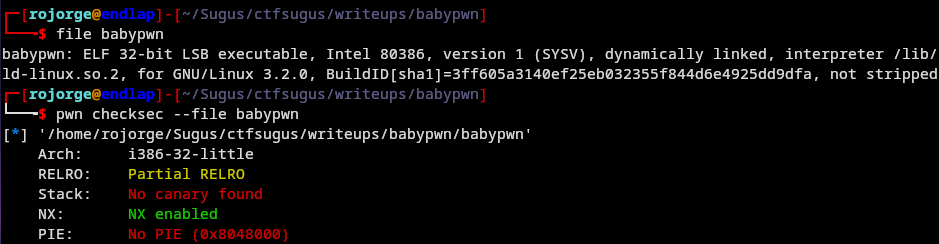
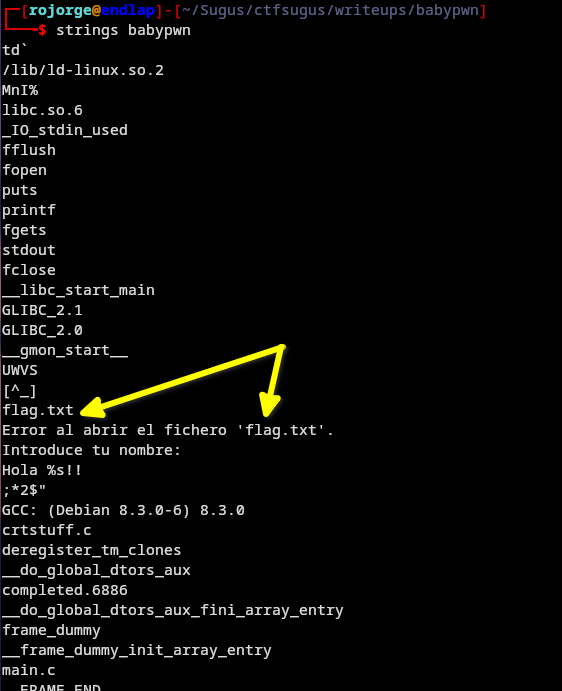
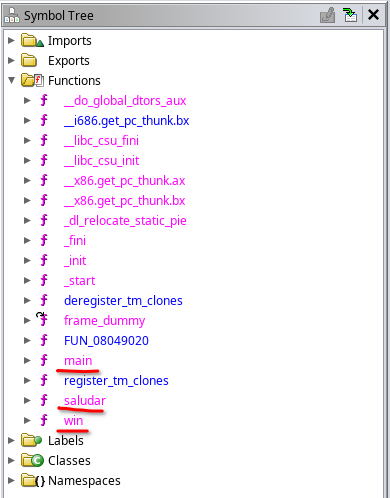
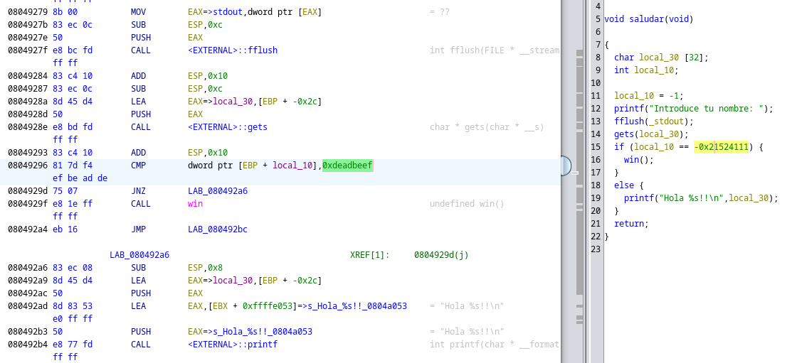
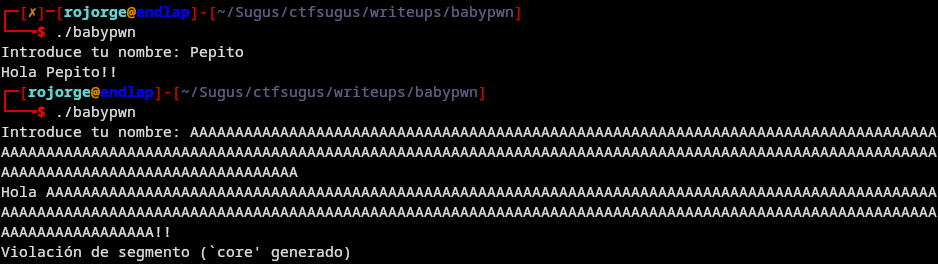
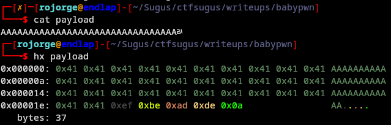
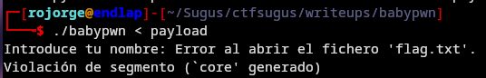
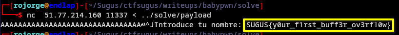

# BabyPwn

En este reto de dificultad facil aprenderemos como hacer uno de los ataques más sencillos de pwn, un Buffer Overflow para modificar una variable. ¡A por ello!
Si tienes cualquier duda sobre la resolución me puedes contactar al telegram: @Rojorge
También te puede ser de ayuda este vídeo: https://youtu.be/5-ZQubBWz3c?si=0r1XWgh6J8T28TTj

# Análisis estático
## Análsis del binario
Lo primero que haremos será descargar el binario, una vez en nuestra máquina, vamos a analizarlo de forma estática, es decir, sin ejecutarlo.

Para ello lo primero que debemos saber es ante que tipo de ejecutable nos encontramos, utilizaremos el comando file:

Como podemos ver, nos indica que estamos ante un ELF de 32 bits (!) con formato Little Endian (LSB). Si usamos checksec, presente en la libreria de python pwntools, podemos ver información con la que se ha compilado y descubrimos que no tiene canario ni PIE. Luego veremos por qué es interesante.

Una vez sacada esta información vamos a ejecutar el comando strings, pues a veces podemos encontrar información con las cadenas de texto (en algunos retos de reversing incluso la flag...):

Hay poca información, pero podemos intuir que la flag se lee de un fichero.

## Análisis del pseudocódigo
Ahora utilizaremos el software ghidra para obtener un pseudocódigo. Otra opción es directamente abrirlo con radare2, ida o gdb para leer directamente el ensamblador, pero dado que es un reto sencillo, ghidra será mas que suficiente.

Por no alargar el writeup no me detendré a explicar como funciona Ghidra, pero aquí tenéis la web oficial (https://ghidra-sre.org/), solamente hay que crear un proyecto, añadir el binario y analizarlo.

Tras abrir el binario y analizarlo podemos ir a ver las funciones:

Como vemos destacan main, saludar y win. Main es la primera función que se llama, asi que empezamos por ella, tras abrirla con doble click y fijandonos en la parte derecha para leer el pseudocódigo, vemos que solamente hace una llamada a saludar(). Si abrimos saludar podemos obtener el siguiente pseudocódigo:

Analicemos que ocurre línea a línea:

En las líneas 8 y 9 declara las variables, la primera se trata de un buffer de 32 caracteres (local_30), mientras que la segunda es un entero (local_10). Posteriormente asigna el valor -1 a local_10, pide al usuario que le de su nombre y lo guarda en local_30. Finalmente encontramos un if, si la variable vale -0x21524111 llamará a la función win (que simplemente imprime la flag leyendola de un fichero), en caso contrario solamente saluda al usuario. 

Dado que es un número un poco feo, si hacemos doble click en el pseudocódigo nos lleva a la línea de ensamblador que lo ha generado, ahí podemos ver cómo lo que está haciendo es comparar el valor que hay en local_10 con 0xdeadbeef.

Hasta aquí bien, pero si en ningún momento nos pide modificar esa variable, ¿cómo cambiamos su valor? Si observamos bien, la entrada del usuario se realiza con la función gets, la cual es una función vulnerable pues no tiene un limite de caracteres, y en caso de introducir más de los que caben en el buffer (en este caso 32), seguirá modificando la memoria. Más info en: https://faq.cprogramming.com/cgi-bin/smartfaq.cgi?answer=1049157810&id=1043284351

# Análisis dinámico
Ahora vamos a ejecutar el binario para ver su funcionamiento:

Como podemos ver, la primera vez introducimos una entrada esperada, y el programa funciona como debería, en cambio, la segunda vez introducimos más caracteres de los que espera, produciendo un core. Cuando se produce una violación de segmento es porque estamos accediendo a una dirección de memoria a la que no deberíamos estar accediendo, lo cual implica que hemos tocado algo que no deberíamos haber podido tocar, y como hackers, eso es bueno... veamos como seguir.

Lo que tenemos que hacer es llenar el buffer y posteriormente escribir el valor que tendrá la variable entera, para ello podemos utilizar python2 (python3 suele dar problemas). Utilizaremos la siguiente linea para generar el exploit:

$ python2 -c "print 'A'*32 + '\xef\xbe\xad\xde'" > payload

Lo primero que imprimimos son los 32 caracteres que llenan el buffer, en este caso As, posteriormentescribimos el valor que queremos que tenga la variable, que os preguntaréis, ¿de donde sale ese churro y por qué? A eso vamos.
Queremos que la variable tenga el valor 0xdeadbeef, si escribiesemos directamente 'deadbeef' estaríamos guardando caracteres ascii (una cadena de texto), no los bits que forman el int, para ello utilizamos \xNN para guardar los bytes. El motivo de escribirlo como \xef\xbe\xad\xde y no como \xde\xad\xbe\xef es que como vimos antes, estamos en arquitectura Little Endian. Si imprimimos eso por terminal va a generar caracteres raros porque va a intentar interpretar códigos ascii que no son letras como tal, por ello lo desviamos al fichero payload, aqui podemos verlo:

# Explotación local
Para probar el payload en nuestra máquina, solamente habrá que ejecutar el binario redirigiendo la entrada desde el payload, y saldría algo así:

Como vemos intenta abrir la flag pero como el fichero no existe da ese error, pero ha funcionado. Si creas un archivo llamado flag.txt te mostrará su contenido.

# Explotación remota y obtención de la flag
Finalmente, tenemos que tirar el payload contra el binario que está en el servidor, para ello usaremos la herramienta netcat redirigiendo la entrada igual que con el binario.

Pwned! La flag es nuestra :)
SUGUS{y0ur_f1rst_buff3r_ov3rfl0w}
