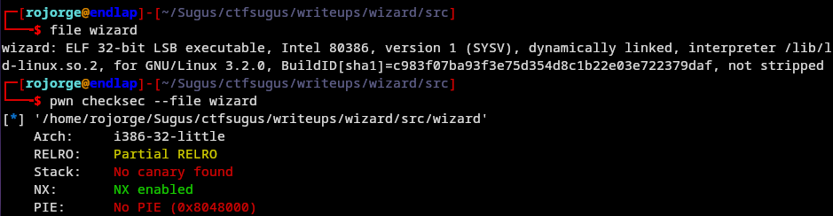
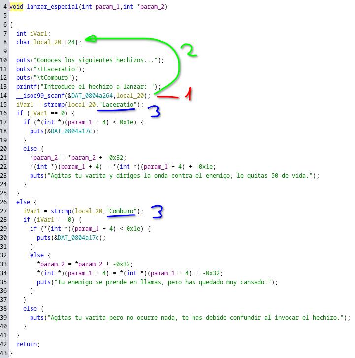
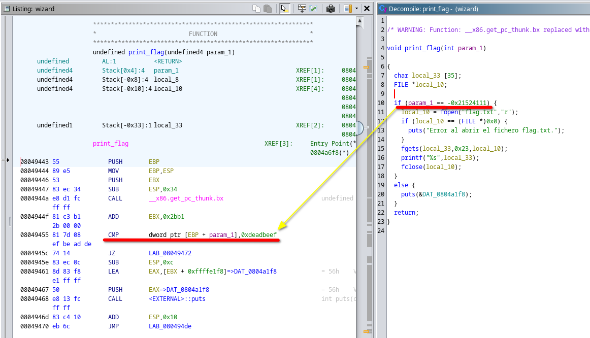
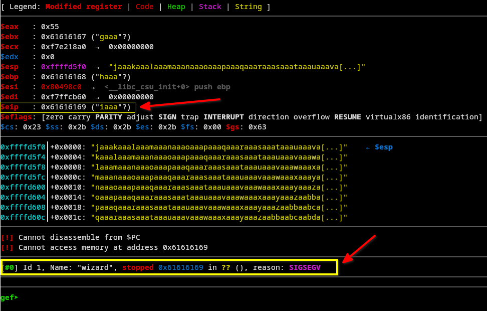
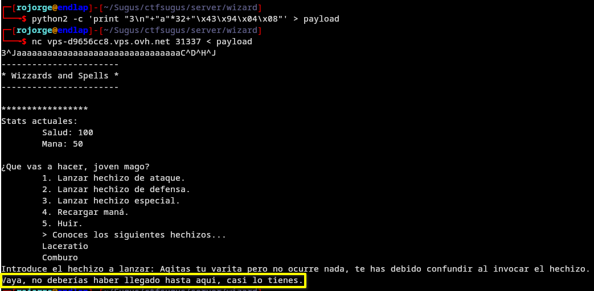
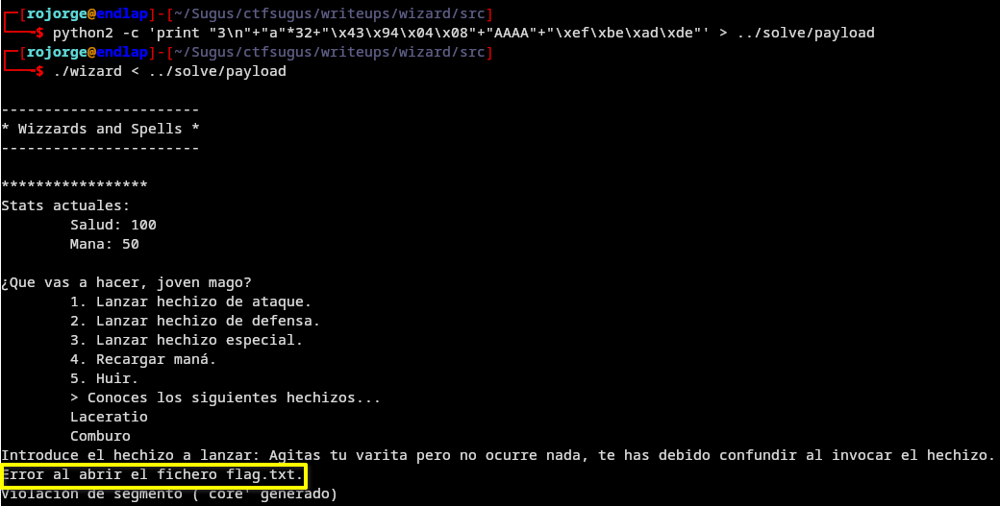
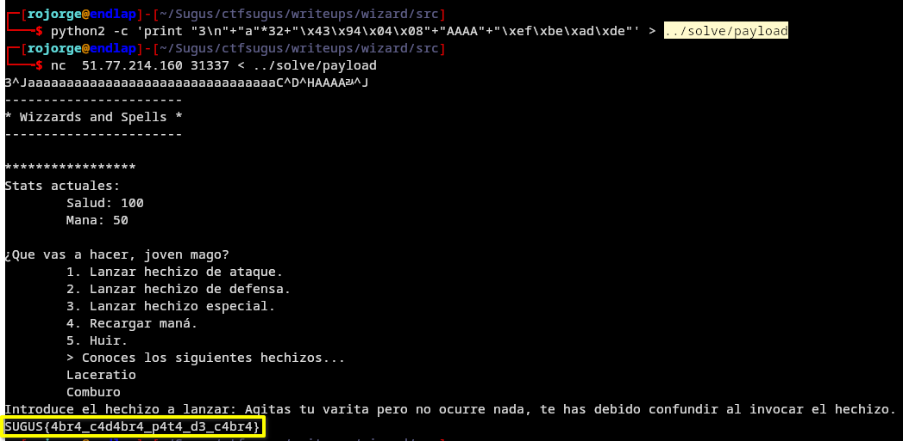

# Wizard

En este reto aprenderemos a detectar una vulnerabilidad que nos permitirá hacer un ret2win con argumentos, accediendo a una función a la que no deberíamos haber podido acceder.

## Análisis estático



Como podemos ver, nos encontramos ante un ELF de 32 bits y arquitectura Little Endian, el cual no tiene ni canario ni PIE, por lo que podemos sobreescribir el stack y además conocemos las direcciones de memoria de las funciones pues no cambian entre ejecuciones.

Si abrimos y analizamos el binario con Ghidra vemos que tiene muchas funciones, entre ellas una llamada print_flag(), que es donde queremos llegar. La que nos atañe se trata de lanzar_especial(), función que se llama cuando el usuario selecciona la acción 3 en el menú. Veamos que hace esta función:



Como vemos [1] se pide al usuario la entrada del "hechizo" y [2] se guarda en la variable local_20 para luego [3] compararse con alguno de los dos hechizos que conoce.

La vulnerabilidad se encuentra en que a diferencia de en el menú de acción, donde eliges un número entre el 1 al 5 para ver que haces, aqui se te pide introducir el hechizo como una cadena de texto que después se compara. Además, al usar scanf y guardarlo en un buffer con un tamaño definido, se puede hacer el overflow.

Lo que queremos conseguir es modificar la dirección de retorno para, en el momento de hacer el return en esta función, "volver" a print_flag() en vez de a la función que llamó a esta, lo que se conoce como un ret2win. Además, si abrimos la función print_flag() podemos ver que requiere un argumento para imprimir la flag:




# Análisis dinámico y exploit local
Ya sabemos que atacar, veamos cómo hacerlo.
Primero vamos a obtener la cantidad de caracteres que se necesitan introducir para poder modificar la dirección de retorno. Para esto utilizaremos el plugin de GDB llamado GEF (https://github.com/hugsy/gef) aunque existen otras herramientas que hacen lo mismo. Para generar el padding usaremos la libreria de python pwntools:

```
$ pwn cyclic 200
aaaabaaacaaadaaaeaaafaaagaaahaaaiaaajaaakaaalaaamaaanaaaoaaapaaaqaaaraaasaaataaauaaavaaawaaaxaaayaaazaabbaabcaabdaabeaabfaabgaabhaabiaabjaabkaablaabmaabnaaboaabpaabqaabraabsaabtaabuaabvaabwaabxaabyaab
```
Que como veis, genera un patrón que nos permitirá indentificar el padding.

Ahora ejecutaremos con gef el binario e introduciremos esa cadena al momento de introducir el hechizo (acción 3), el programa debería pararse al producirse la violación de segmento (core)



Como vemos, nos indica que la dirección a la que ha intentado acceder es 0x61616169, que se corresponde con los valores ascii iaaa. Para obtener el padding usamos el siguiente comando:

```
$ pwn cyclic -l iaaa
32
```

Además, al no tener PIE, como vimos en el análisis estático, podemos conocer con facilidad la dirección de la función. Podemos hacerlo con muchas herraminetas (ghidra, radare2, ida...) pero usaremos GDB. Para ello abrimos el binario e introducimos la linea 'info functions', donde veremos la siguiente línea entre todas las demás '0x08049443  print_flag'. Con esto ya podemos hacer la primera versión del payload que nos permita acceder a la función. Usaremos python2 por su sencillez, aqui va la línea:

```
$ python2 -c 'print "3\n"+"a"*32+"\x43\x94\x04\x08"' > payload
```

Primero enviamos el 3 para seleccionar la opción donde está la vulnerabilidad, luego mandamos 32 caracteres para llegar a la dirección de retorno que queremos, y posteriormente introducimos en little endian y como bytes la dirección de la cadena a la que queremos acceder. Dado que esos bytes se pueden mostrar como ningún caracter ascii, darían problemas si los mostramos y luego copiamos y pegamos, asi que directamente los enviamos a un fichero.



Como vemos, hemos llegado a la función, pero nos falta meter el argumento para que podamos imprimir la flag. Para añadirlo debemos incluir lo que sería la siguiente dirección de retorno, que en este caso nos da igual, y posteriormente lo que queremos enviar en little endian, que como vimos en la caputura de ghidra de la función, se trata de 0xdeadbeef en int, por lo que tendremos que tratarlo igual que en la función:

```
$ python2 -c 'print "3\n"+"a"*32+"\x43\x94\x04\x08"+"AAAA"+"\xef\xbe\xad\xde"' > payload
```



¡Lo tenemos! Si quisiesemos que no diese un core podríamos cambiar los AAAA del payload por la dirección correcta, pero nos da igual. También podemos crear un fichero flag.txt para que se abra pero como prueba de concepto, esto sobra. Ahora toca obtener la flag.

# Obtención de la flag

Ahora debemos enviar el payload al servidor en vez de al proceso de nuestra máquina, lo haremos con la herramienta netcat:



PWNED!
SUGUS{4br4_c4d4br4_p4t4_d3_c4br4}

Muchas gracias por leer el writeup, cualquier duda puedes contactarme al telegram: @Rojorge


